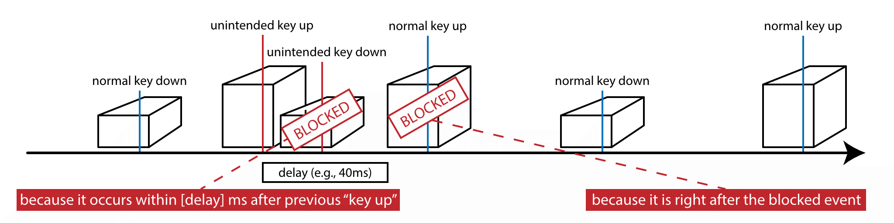
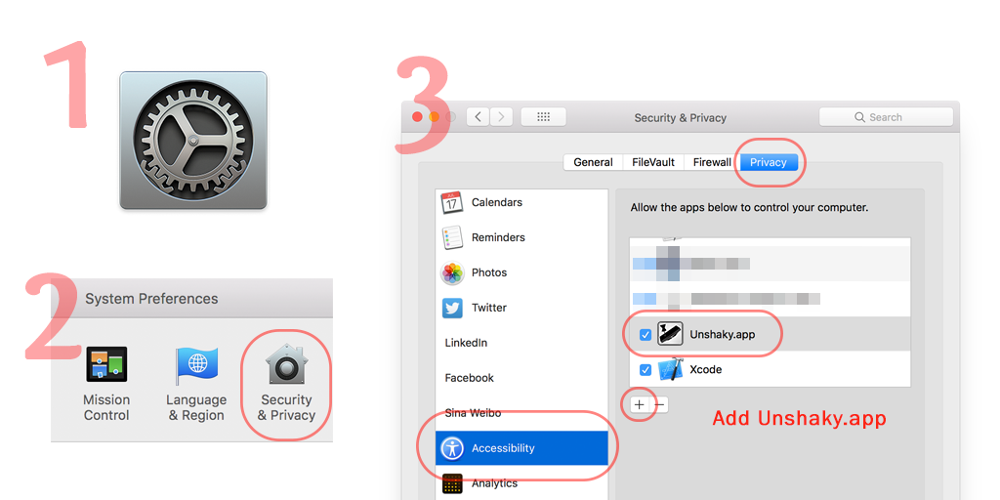
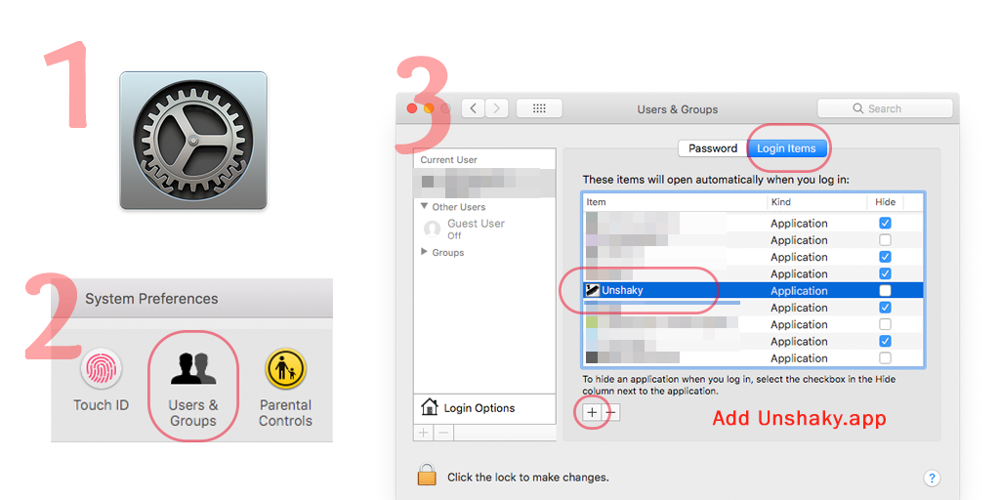
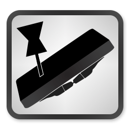
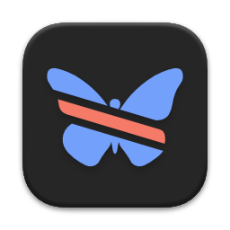

#  Unshaky
  

**It seems on macOS 10.15.6, Unshaky no longer works unless by default, workaround: [issue #166](https://github.com/aahung/Unshaky/issues/166)**

**Unshaky** tries to address an issue on the butterfly keyboard (Macbook, Macbook Air 2018 & MacBook Pro 2016 and later): Double Key Press (See "[User complaints](#complaints-about-this-issue)" below). 

Apple made it difficult to replace only the keyboard and it costs hundreds of dollars. **Unshaky** might save your keyboard by dismissing such "second key hits" (any key presses that occur no later than x milliseconds after the previous effective one). I fixed my "w" key with **Unshaky**, and if it does not work for you, open an issue [here](https://github.com/aahung/Unshaky/issues). The image below illustrates how Unshaky works.

[June 2018] Good news, Apple launched a [Keyboard Service Program for MacBook and MacBook Pro](https://www.apple.com/ca/support/keyboard-service-program-for-macbook-and-macbook-pro/), and go get your keyboard fixed, maybe temporarily.

[May 2019] Apple extends [the service program](https://www.apple.com/ca/support/keyboard-service-program-for-macbook-and-macbook-pro/) to cover all MacBook (Air & Pro) with 3rd gen butterfly keyboards.

[May 2020] [The Verge: The saga of Apple’s bad butterfly MacBook keyboards is finally over](https://www.theverge.com/2020/5/4/21246223/macbook-keyboard-butterfly-magic-pro-apple-design).

## Complaints about this issue

- [Keyboard 'B' key double hit problem](https://www.ifixit.com/Answers/View/402016/Keyboard+%27B%27+key+double+hit+problem)
- [MacBook Pro 2016 Random Key Repeat Keyboard Issue](https://discussions.apple.com/thread/7840547)
- [MacBook Pro 13" 2016 Double Key Press](https://forums.macrumors.com/threads/macbook-pro-13-2016-double-key-press.2025843/)
- [1 key - 2 letters macbook pro 2016 and 2017](https://apple.stackexchange.com/questions/293523/1-key-2-letters-macbook-pro-2016-and-2017)
- [The new and improved MacBook keyboards have the same old problems](https://theoutline.com/post/6409/the-new-and-improved-macbook-keyboards-have-the-same-old-problems?zd=1&zi=4qyu5ngi)
- [Reddit: MBP 2018 15" Sticky Key Problem!](https://www.reddit.com/r/macbook/comments/9n8qkg/mbp_2018_15_sticky_key_problem/)
- [Reddit: My Experience with Macbook Pro 2018 Keyboard](https://www.reddit.com/r/macbook/comments/9n8hgi/my_experience_with_macbook_pro_2018_keyboard/)
- [Reddit: Anyone. with heir MBP 2018. keyboard. that. had. problems but is getting worse? Does a keyboard cover fix this?](https://www.reddit.com/r/macbookpro/comments/a1yul8/anyone_with_heir_mbp_2018_keyboard_that_had/)
- [Reddit: 2018 Known Keyboard Issue - repeating/sticky keys, silicone covers, compressed air](https://www.reddit.com/r/macbookpro/comments/a5jzyu/2018_known_keyboard_issue_repeatingsticky_keys/)
- [Apple Discussion: MacBook Pro 15" (2018) Keyboard "t" key repeating issue?](https://discussions.apple.com/thread/8536157) (55K have this question too on Feb 22, 2019)
- [Reddit: MacBook Air 2018 keyboard problem](https://www.reddit.com/r/macbookair/comments/ak9ptt/macbook_air_2018_keyboard_problem/)

## How-To (Video Walkthrough)

Click the image below to watch it on YouTube

Can't watch by clicking the image above? [Download mp4 (13MB) file here](https://files.nestederror.cf/file/-public-/How%20to%20install%20and%20setup%20Unshaky.mp4)

## How-To

[Download Unshaky.app here](https://github.com/aahung/Unshaky/releases)

First, move the "Unshaky.app" to your "/Applications" folder.

### Grant Accessibility Permission

[**Why "Input Monitoring" is not enough in Catalina?**](https://github.com/aahung/Unshaky/issues/157#issuecomment-669409152)

Follow the instruction when you first open Unshaky. If the instruction does not work for you, go to System Preferences -> Security & Privacy -> Privacy (Tab) -> Accessibility (Left panel) and add "Unshaky.app." Make sure it is checked.

**Since macOS 10.15.6, also add Unshaky to Privacy (Tab) -> Input Monitoring (Left panel), see [issue #166](https://github.com/aahung/Unshaky/issues/166)**

### Launch at Startup (Optional)

Go to System Preferences -> Users & Groups -> Login Items (Tab) and add "Unshaky.app".

### Configure delays for your defective keys

Click Unshaky icon in the menu bar and select "Configure" to configure delays for the defective keys.

#### How to pick an appropriate delay?

I don't think there is a universal delay value for all people. If you type very fast, you might want to have a shorter delay. I use 40 ms since I am a fast typer. With a long delay, I cannot type "apple" because the second "p" is likely to be blocked. Some users found 60 ms a sweet spot and some have no issue with 80 ms. My suggestion is to start with a short delay (like 40 ms) and gradually increase it.

### For other FAQs, visit [the Wiki](https://github.com/aahung/Unshaky/wiki)

## Community Contributors

- Alexei Molinari (@al3xmill3r74) for v2 Unshaky icon  
- Hazar ([@hazarek](https://github.com/hazarek)) for v3 Unshaky icon  

### Localization

If you can help translate Unshaky into more languages, [open an issue here](https://github.com/aahung/Unshaky/issues/new/choose) so I can prepare related files for translation.

Your contributions are valuable and make Unshaky accessible to more users.

**Big _Thank You_ to these community contributors who provide translations.**

| Language | Contributors |
| -------- | ------------ |
| Chinese  | [_sam](https://nestederror.com) |
| Japanese | forgazer, [HackingGate](https://github.com/HackingGate) |
| French | [xuesongTU](https://github.com/xuesongTU) |
| German | [Felix Grund](https://github.com/ataraxie) |
| Russian | [Alexey Khromets](https://github.com/akhromets) |
| Ukrainian | [Alexey Khromets](https://github.com/akhromets) |
| Turkish | [Hazar Ekinci](https://github.com/hazarek) |
| Korean | [Woosuk Park](https://github.com/readingsnail) |
| Portuguese (Portugal) | [Gonçalo Matos](https://github.com/GoncaloCdM) |
| Italian | [valepert](https://github.com/valepert), [Domenico Corvasce](https://github.com/domcorvasce), [Daniele Torelli](https://github.com/danieletorelli)
| Indonesian | [Elmo Tanu Miharja](https://github.com/elmotan95)
| Spanish (Latin America) | [jadraker](https://github.com/jadraker) |
| Dutch | [Siebrand Mazeland](https://github.com/siebrand), [Zandor Smith](https://github.com/Zandor300)
| Portuguese (Brazil) | [Délisson Junio](https://github.com/delissonjunio) |
| Norwegian | [Runar Skaare Tveiten](https://github.com/runar) |
| Czech | [Michal Zelinka](https://github.com/username0x0a) |
| Slovak | [Michal Zelinka](https://github.com/username0x0a) |
| Polish | [Blaze](https://github.com/blazeblazeblaze), [Artur Kondas](https://github.com/youshy) |
